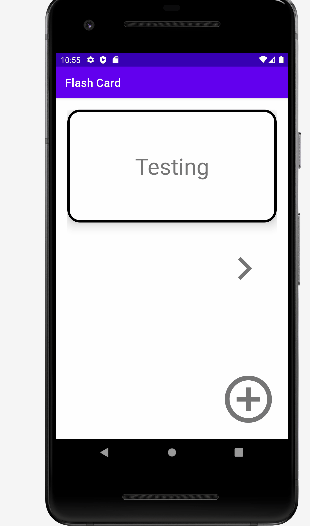

## Flash Card

📝 `NOTE:` Paste the README templates for each subsequent lab here at the top, (i.e. lab 2, 3, 4). This will show a history of your development process including which users tories you completed and how your app looked and functioned at each step.

## Lab 4

### App Description

An application built by Java and Android Studio to support users reivew and relearn knowledge

### App Walk-though

 

## Required

- [x] User sees a transition animation when going from the main screen to the add card screen.
- [x] User sees a reveal animation when the flashcard is tapped and the answer is shown
- [x] User sees flashcards animating in / out when the 'next' button is tapped

## Optional

- [ ] Extra styling is added!
- [ ] User sees a countdown timer for each question
- [ ] User sees a 'card flip' animation when the card is tapped
- [ ] User sees a celebration animation with confetti when they answer a question correctly
