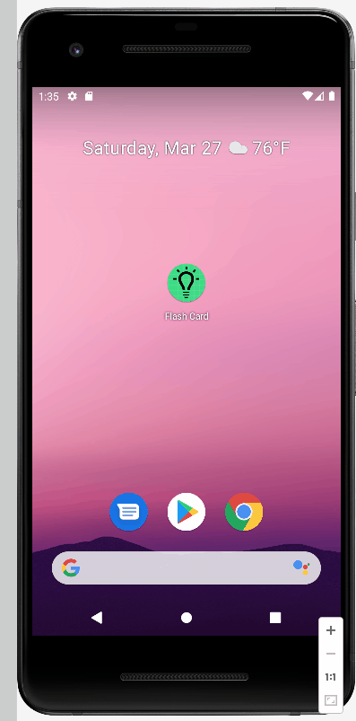

## Flash Card

📝 `NOTE:` Paste the README templates for each subsequent lab here at the top, (i.e. lab 2, 3, 4). This will show a history of your development process including which users tories you completed and how your app looked and functioned at each step.

## Lab 3

### App Description

An application built by Java and Android Studio to support users reivew and relearn knowledge

### App Walk-though

 

## Required

- [x] User can create a card and still see their created card when the app is relaunched.
- [x] User can create muliple cards and browse through all created cards

## Optional

- [ ] User can delete a card and no longer see it in their deck anymore
- [ ] Flashcards are shown in random order instead of the order they were created in
- [ ] User can edit a card and see the edit saved when they browse through their deck of cards
- [ ] User can create flashcards with multiple answers and be able to browse through cards with multiple choice answers shown
